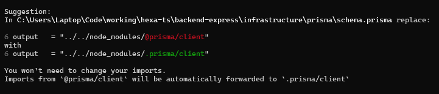
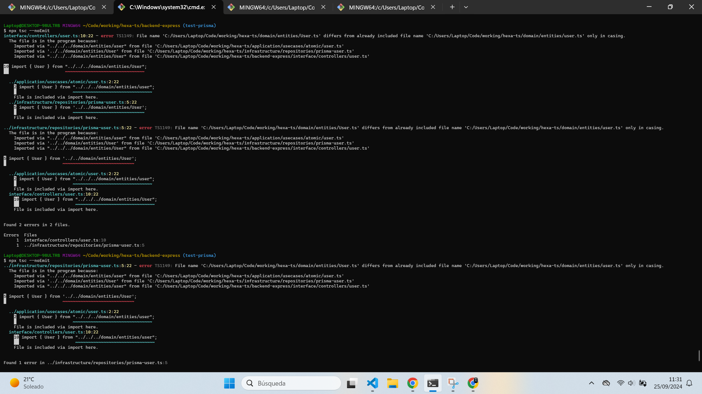

# Proceso

## 1. Migración `backend-express/prisma` -> `backend-express/infrastructure/prisma`
### Objetivo principal
Mover la carpeta `prisma` desde `backend-express` a `backend-express/infrastructure` para mejorar la consistencia en la estructura de la arquitectura hexagonal.

### Detalles
#### Añadir/modificar output en `schema.prisma`
- Actualizar la configuración del generador en `schema.prisma` para apuntar a `@prisma/client` desde `node_modules` utilizando la notación `.prisma/client` y evitar el warning correspondiente.
    
- Para este ejemplo quedara así:
    

#### Generar y migrar Prisma apuntando a la nueva ruta
- Usar la bandera `--schema` para apuntar a la nueva ubicación de `prisma` al ejecutar comandos de Prisma.

## 2. Migrate `infrastructure`
### Objetivo principal
Mover la carpeta `infrastructure` desde `backend-express` a la raíz del proyecto, logrando así una separación total entre las diferentes partes de la arquitectura hexagonal.

Para ello, infrastructure tiene sus propios `node_modules`, los cuales, son completamente independientes del backend o interface, los cuales mantendrán la lógica del backend exclusivamente.

### Detalles
#### Desinstalar paquetes usados para la infrastructure en el backend
- Eliminar los paquetes que utiliza `infrastructure` del backend, asegurando que ambos componentes permanezcan independientes. Utilizar comandos como `npm uninstall @prisma/client` y `npm uninstall -D prisma`.

#### Traspasar infrastructure a la raíz
- Mover la carpeta `infrastructure` de `./backend-express` a `./` (o ruta raíz).
- A continuación, reinstalar las dependencias pero esta vez en la carpeta `infrastructure`.
    - En este ejemplo, lo haremos a traves del archivo `package.json`, el cual vamos a crear en la carpeta `infrastructure` con el siguiente código:
        ```json
        {
            "name": "infrastructure",
            "version": "1.0.0",
            "scripts": {
                
            },
            "dependencies": {
            "@prisma/client": "^5.19.1"
            },
            "devDependencies": {
                "prisma": "^5.19.1"
            }
        }

        ```
    - Después, navegaremos con la terminal a nuestra carpeta `infrastructure` y ejecutaremos el siguiente comando:
        ```bash
            npm i
        ```
    - Ahora hay una carpeta `node_modules` en `infrastructure`: `./infrastructure/node_modules`
#### Configurar tsconfig.json
- Crear un archivo `tsconfig.json` en cada carpeta (`infrastructure`, `core`, `backend-express`).
    - Por ahora si no tienes requerimientos especiales utiliza este template en las tres carpetas:
        ```json
        {
            "compilerOptions": {
            "module": "CommonJS",
            "target": "ES2020",
            // "rootDir": "../", // ❓ Establece la carpeta raíz, sino la raíz es donde esta tsconfig.json
            "lib": [ "esnext"],
            // "lib": ["dom", "esnext"], // ✅⚠️ Biblotecas de tipos que importara ❓
            // "moduleResolution": "node", // ✅ Resolucion de modulos
            // "resolveJsonModule": true, // ✅ Permite importar archivos json 
            "esModuleInterop": true, // ✅ Interoperabilidad entre CommonJS y ES6
            "skipLibCheck": true, // ❓ Omitir verificación de tipos en .d.ts
            "strict": true, 
            "forceConsistentCasingInFileNames": true // ✅ Forzar mayúsculas y minúsculas en nombres de archivo
            },
            "include": ["<carpeta-en-esta-carpeta>", "./<otra-carpeta-de-la-carpeta>", "<[...]>"], // 🖊️🧠⚠️‼️ Carpetas las cuales va a incluir‼️
            "exclude": ["<carpeta-a-excluir-en-esta-carpeta>", "./<otra-carpeta-a-excluir-dentro-de-la-carpeta>", "<[...]>]"] //🖊️🧠⚠️‼️ Carpetas las cuales va a excluir‼️
        }
        ```
- Lo importante en este punto es que las carpetas tengan su propio `tsconfig.json`, para mantener el máximo de consistencia en la arquitectura. Todo y no ser obligatorio y poder buscar otros enfoques.
    - [Puedes ver esta question abordada aquí](./q-tsconfig.md)
    - Mas adelante, se modifica el tsconfig.json para adaptar-se concretamente a esta estructura.

#### Reestructurar Prisma
- Actualizar la ruta de `@prisma/client` en el nuevo `schema.prisma`, y ejecutar comandos de generación y migración para asegurar que todo funcione correctamente.
    - Para esto podemos simplemente borrar el output añadido en el [Punto 1. Migración `backend-express/prisma` -> `backend-express/infrastructure/prisma`](#añadirmodificar-output-en-schemaprisma)
    - Después, actualiza Prisma, generando y migrando.
        - Para este ejemplo, puedes utilizar los siguientes comandos:
            ```bash
                npx prisma generate
                npx prisma migrate dev
            ```
        
### Cambio estructura
<details><summary><h4 align="center"> Estructura antigua</h4></summary>

```
project/
├── core/
│   ├── domain/
│   │   ├── entities/
│   │   │   ├── User.ts
│   │   │   └── Post.ts
│   │   └── errors/
│   │       ├── main.ts
│   │       └── <others>.ts
│   └── application/
│       ├── usecases/
│       │   ├── CreateUserUseCase.ts ⚠️🖊️
│       │   └── CreatePostUseCase.ts ⚠️🖊️
│       ├── repositories/
│       │   ├── user.d.ts
│       │   └── post.d.ts
│       ├── services/
│       │   ├── email.d.ts
│       │   └── auth.d.ts
│       └── ports/ ❓🖊️
│           ├── in/
│           │   └── UserControllerPort.ts
│           └── out/
│               └── UserPersistencePort.ts
├── backend/
│   ├── infrastructure/
│   │   ├── prisma/ 
│   │   │   └── schema.prisma
│   │   ├── repositories/
│   │   │   ├── prisma-user.ts
│   │   │   └── prisma-post.ts
│   │   └── config/
│   │       └── prisma-db.ts
│   └── interfaces/ 
│       ├── controllers/
│       │   └── ExpressUserController.ts
│       └── routes/
│           └── userRoutes.ts
│   ├── package.json
│   ├── tsconfig.json
│   └── ...
├── frontend/
│   ├── src/
|   │   └── ...
|   ├── package.json
|   └── tsconfig.json
└── tsconfig.json
    
```
</details><br/>
<div align="center">
⬇️⬇️⬇️⬇️⬇️⬇️⬇️⬇️⬇️
</div>

<details><summary><h4 align="center"> Estructura actual</h4></summary>

```
project/
├── core/
│   └── ... (sin cambios)
├── infrastructure/
│   ├── prisma/
│   │   └── schema.prisma
│   ├── repositories/
│   │   ├── prisma-user.ts
│   │   └── prisma-post.ts
│   ├── config/
│   │   └── prisma-db.ts
│   ├── package.json
│   └── tsconfig.json
├── backend/
│   ├── interfaces/ 
│   │   ├── controllers/
│   │   │   └── ExpressUserController.ts
│   │   └── routes/
│   │       └── userRoutes.ts
│   ├── package.json
│   ├── tsconfig.json
│   └── ...
├── frontend/
│   └── ... (sin cambios)
└── tsconfig.json ❌⚠️
```
</details><br/>

## 3. Añadir jest al `core`
### Objetivo principal
Integrar pruebas unitarias en el `core` de la aplicación, garantizando la independencia de su lógica y demostrando los beneficios que las pruebas aportan a la arquitectura general. 
### Detalles
#### Configuración jest
- Instalar las dependencias necesarias para ejecutar el testing en la carpeta `core`
    - Primero, asegurar tener Jest configurado en tu proyecto. Si no lo tienes, puedes instalarlo con los siguientes comandos una vez situado en la carpeta `core`:
        ```bash
        npm install --save-dev jest ts-jest @types/jest
        ```
    - Luego, crear un archivo de configuración jest.config.js si no lo tienes aún:
        ```js
        module.exports = {
            preset: 'ts-jest',
            testEnvironment: 'node',
            moduleNameMapper: {
            '^application/(.*)$': '<rootDir>/application/$1',
            '^domain/(.*)$': '<rootDir>/domain/$1',
            },
            roots: ['<rootDir>/test'], // Asegúrate de que Jest busque en esta carpeta
        };
        ```
    - Para terminar, añade la carpeta test al include del `tsconfig.json` del `core`.
#### Test, fix and repeat
- Ejecutar las pruebas y corrige los problemas que puedan afectar la independencia del `core`, asegurándote de que las funciones operen como se espera. Durante este proceso, es posible que notes lo siguiente:
    - La entidad `LikePost` no estaba definida, lo que impedía que las pruebas se completaran correctamente.
    - Las operaciones de actualización no verificaban la existencia de la entidad, lo cual es una buena práctica y debe implementarse.

## 4. Mejorar arquitectura
### Objetivo principal
Explorar mejoras a la actual arquitectura, obteniendo una mejor consistencia y una mayor independencia en las diferentes partes.
### Detalles
#### Separar la app y el domain a la ruta raíz
- Eliminar la carpeta `core`, manteniendo los tests de Jest únicamente en la carpeta `application`. Esto permitirá que las tres partes principales de la arquitectura sean completamente independientes.
    - Utilizar el Gestor de archivos de tu sistema, el del Entorno de desarrollo (IDE) o la terminal.
- Configurar los archivos `tsconfig.json` para que se adapten correctamente a la nueva estructura de carpetas.
    - Probar distintas combinaciones hasta encontrar la que mejor se adapta a las importaciones.
    - Utilizar las propiedades include y exclude para indicar las partes a incluir y excluir en cada carpeta.
- **La jerarquía actual para la importación de tipos** se establece de la siguiente manera, donde **los niveles superiores no dependen de clases ni tipos de los niveles inferiores:**
    1. Domain
    2. Application
    3. Infrastructure
    4. Backend
#### Traspasar entities de classes a tipos
- Cambiar las entities para en vez de usar classes usar tipos, ya que no estamos utilizando métodos en las classes.
    - Configuramos el tsconfig.json de la application para que no fuerce las mayúsculas.
        ```json
          "forceConsistentCasingInFileNames": false // ✅ Forzar mayúsculas y minúsculas en nombres de archivo
        ```
        - De esta forma, evitamos el siguiente error:
            

### Cambio estructura

<details><summary><h4 align="center"> Estructura antigua</h4></summary>

```
project/
├── core/
│   ├── domain/
│   │   ├── entities/
│   │   │   ├── User.ts
│   │   │   └── Post.ts
│   │   └── errors/
│   │       ├── main.ts
│   │       └── <others>.ts
│   └── application/
│       ├── usecases/
│       │   ├── CreateUserUseCase.ts ⚠️🖊️
│       │   └── CreatePostUseCase.ts ⚠️🖊️
│       ├── repositories/
│       │   ├── user.d.ts
│       │   └── post.d.ts
│       ├── services/
│       │   ├── email.d.ts
│       │   └── auth.d.ts
│       └── ports/ ❓🖊️
│           ├── in/
│           │   └── UserControllerPort.ts
│           └── out/
│               └── UserPersistencePort.ts
├── infrastructure/
│   ├── prisma/
│   │   └── schema.prisma
│   ├── repositories/
│   │   ├── prisma-user.ts
│   │   └── prisma-post.ts
│   ├── config/
│   │   └── prisma-db.ts
│   ├── package.json
│   └── tsconfig.json
├── backend/
│   └── interfaces/ 
│       ├── controllers/
│       │   └── ExpressUserController.ts
│       └── routes/
│           └── userRoutes.ts
│   ├── package.json
│   ├── tsconfig.json
│   └── ...
├── frontend/
│   ├── src/
|   │   └── ...
|   ├── package.json
|   └── tsconfig.json
    
```

</details> <br/>

<div align="center">
⬇️⬇️⬇️⬇️⬇️⬇️⬇️⬇️⬇️
</div>

<details><summary><h4 align="center"> Estructura actual</h4></summary>


```
project/
├── domain/
│   ├── entities/
│   │   ├── User.ts
│   │   └── Post.ts
│   ├── errors/
│   │   ├── MainError.ts
│   │   └── <other-errors>.ts
│   └── tsconfig.json
├── application/
│   ├── usecases/
│   │   ├── CreateUserUseCase.ts ⚠️🖊️
│   │   └── CreatePostUseCase.ts ⚠️🖊️
│   ├── repositories/
│   │   ├── IUserRepository.ts
│   │   └── IPostRepository.ts
│   ├── services/ ❓⚠️
│   │   ├── IEmailService.ts
│   │   └── IAuthService.ts
│   ├── test/
│   │   ├── user/
│   │   │   └── createUser.test.ts
│   │   └── post/
│   │       └── updatePost.test.ts
│   ├── ports/ ❓🖊️
│   │   ├── in/
│   │   │   └── IUserControllerPort.ts
│   │   └── out/
│   │       └── IUserPersistencePort.ts
│   ├── package.json
│   ├── tsconfig.json
│   └── ...
├── infrastructure/
│   ├── prisma/
│   │   └── schema.prisma
│   ├── repositories/
│   │   ├── PrismaUserRepository.ts
│   │   └── PrismaPostRepository.ts
│   ├── config/
│   │   └── PrismaDbConfig.ts
│   ├── package.json
│   ├── .env
│   ├── tsconfig.json
│   └── node_modules
├── backend/
│   └── interfaces/
│       ├── controllers/
│       │   └── ExpressUserController.ts
│       ├── routes/
│       │   └── UserRoutes.ts
│   ├── package.json
│   ├── tsconfig.json
│   └── ...
├── frontend/
│   ├── src/
│   │   └── ...
│   ├── package.json
│   ├── tsconfig.json
│   └── ...

```

</details><br/>

## 5. API Swagger
### Objetivo principal
Explorar documentación de API usando JSDocs y Swagger.
### Detalles
#### Configurar Swagger
- Instalar las dependencias necesarias en la carpeta backend.
    - Usar JSDocs para documentar cada uno de los endpoints de la API.
    - Usar swagger-jsdoc para generar la documentación de la API.
    - Usar swagger-ui-express para visualizar la documentación de la API.
- En la función de configuración de las opciones de swagger, tener en cuenta la ruta donde se utilizara, no la ruta donde esta dicho archivo, para apuntar a las rutas que contienen la información de Swagger.
#### Documentar endpoints
- Documentar endpoints de la API, se recomienda hacer en los usecases de la aplicación y definir el orden de los tags en el main de las routes.
- Para ello puedes ver los diferentes ejemplos utilizados hasta las funciones de users.

## 6. Sub-módulos de Github
### Objetivo principal.
Añadir sub-módulos de github para controlar las partes del proyecto
### Detalles
- Modificar las carpetas de la raíz para que cada una sea un sub-módulo de github
- Añadir los sub-módulos al repositorio de github
- Puedes encontrar más información sobre como añadir sub-módulos [aquí](./q-submodule.md)

## 7. [Crear el frontend con Astro](../frontend-astro/md/proceso.md)
## 8. Detalles finales
### Objetivo principal
Añadir los endpoints y modificaciones necesarias para cumplir con los requisitos del cliente y finalizar la primera parte del proyecto.
### Detalles
- [ ] Añadir a los Posts: authorName, fecha de creación/modificación y likes 
- [x] Añadir endpoint para obtener el total de usuarios
- [x] Añadir endpoint para el buscador de posts, por titulo y/o por contenido
- [ ] ❓Añadir la funcionalidad de signup devolver un token (iniciar sesión)
- [x] Empezar a migrar hacia una estructura mas solida y modular, con "shared" folders como `utils` o `web components`, etc... utilizando sub-modules de Github.
    - [ ] Retirar md como sub-módulo